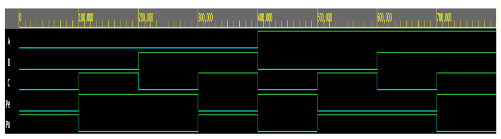
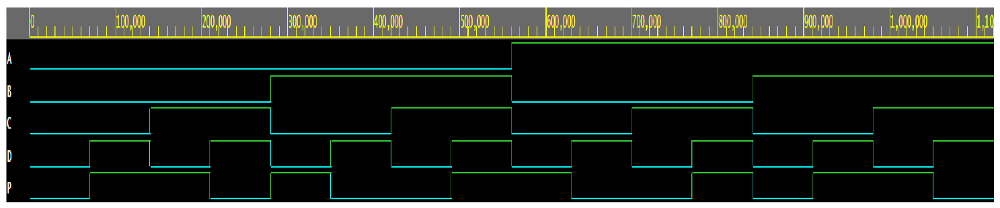
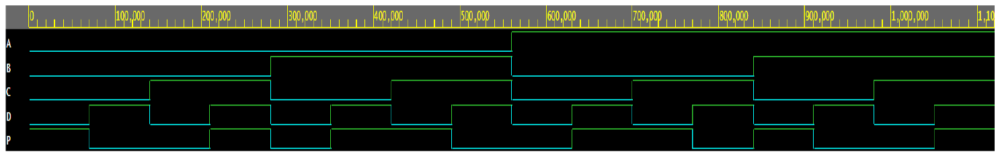

# PARITY GENERATOR AND CHECKER USING VERILOG
## Introduction
* A parity generator is a digital circuit that takes a set of data bits as input and generates a single parity bit as output. The purpose of the parity bit is to provide basic error detection in data transmission or storage systems. Parity is a simple form of error checking, commonly used in applications where error detection is required but not error correction.
* A Parity even checker is a digital circuit that takes a set of data bits along with a parity bit as input and checks whether the combination of data bits and the provided parity bit results in even parity or not. It is used for error detection purposes, particularly when data is transmitted or stored with parity bits.
* A Parity odd checker is a digital circuit that takes a set of data bits along with a parity bit as input and checks whether the combination of data bits and the provided parity bit results in odd parity or not. Like the Parity even checker, it is used for error detection purposes when data is transmitted or stored with parity bits.
* In Structural Verilog, we describe a digital circuit as a hierarchy of interconnected modules. Each module is defined using its own input, output, and internal signals. We instantiate modules and connect their signals together to create the desired circuit.

## OUTPUT

   
  Parity generator

   
  Parity even checker

   
  Parity odd checker

